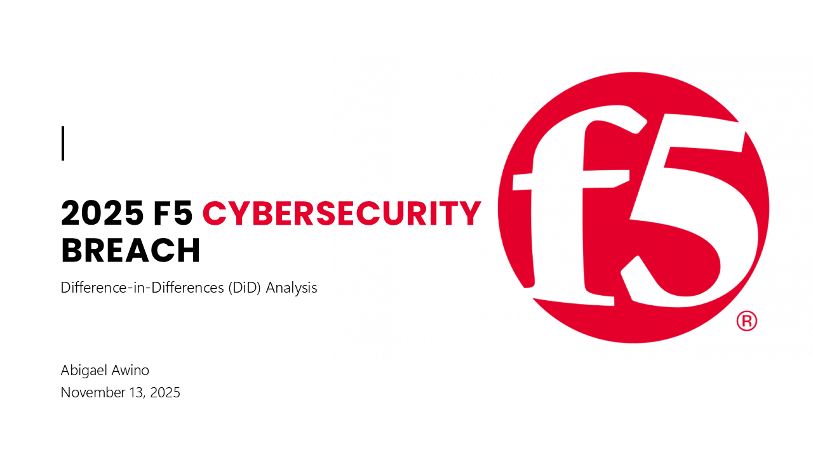
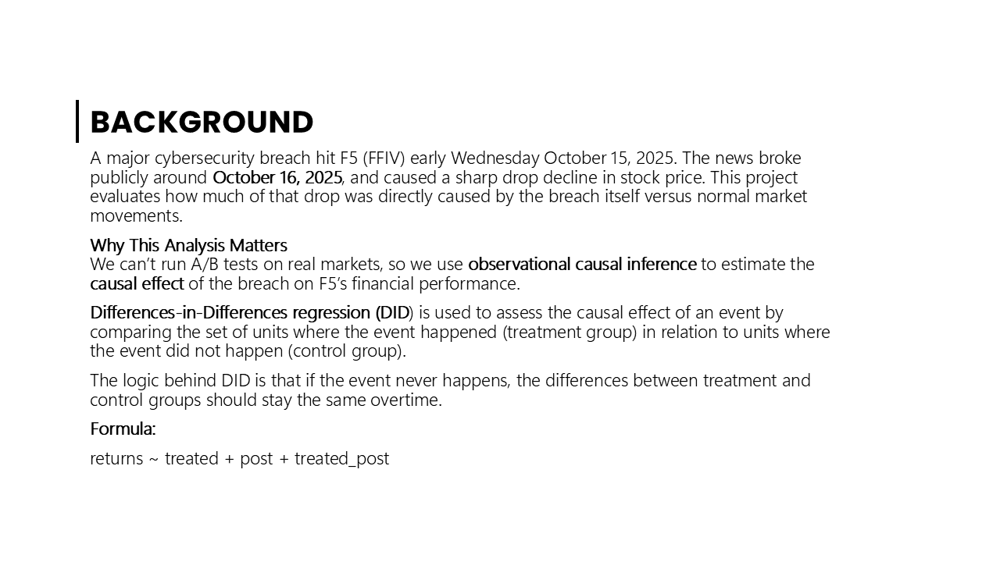
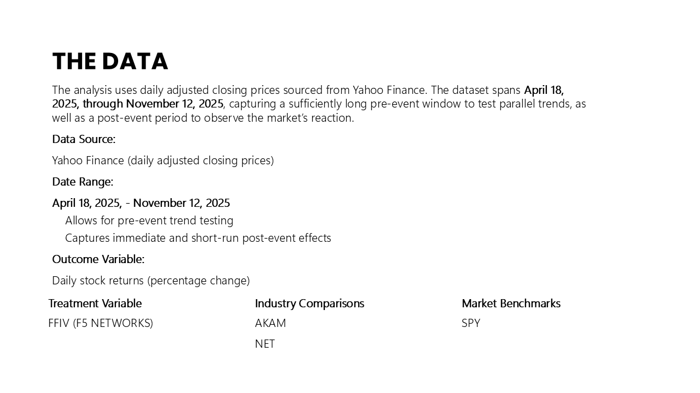
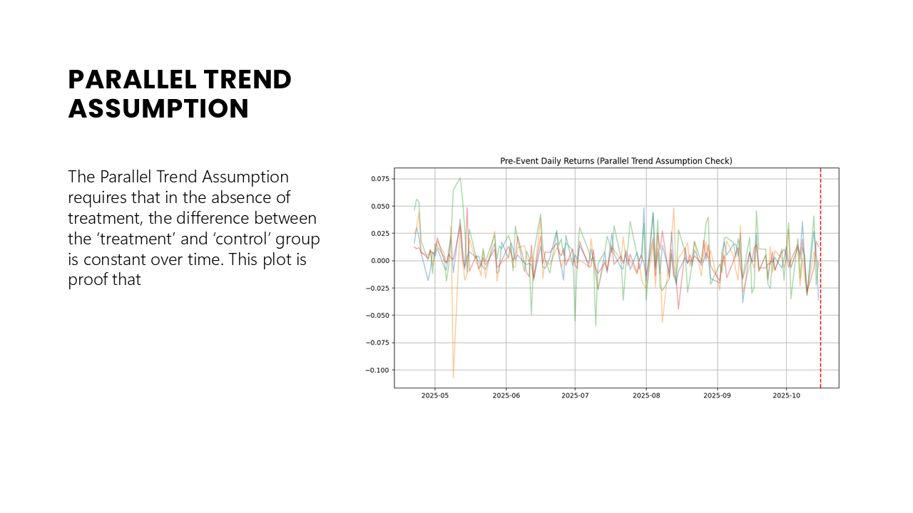
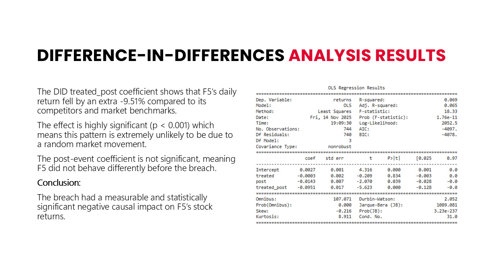
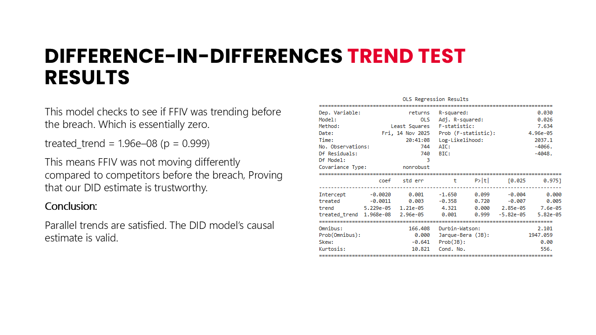
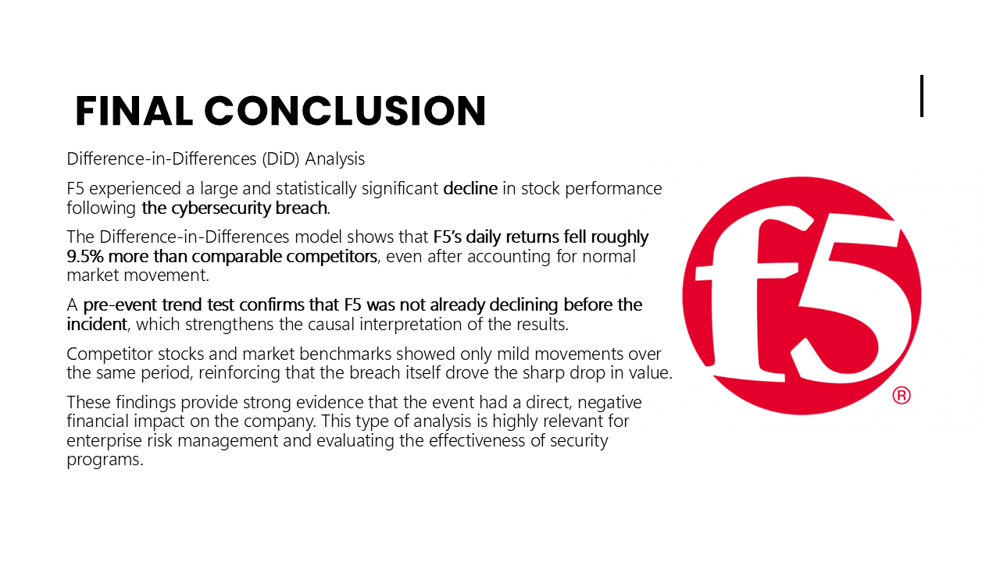

# Causal Impact of the 2025 F5 Networks Cybersecurity Breach  
### Difference-in-Differences Analysis of Stock Market Reaction

This project analyzes the causal impact of the **October 2025 cyber breach at F5 Networks (FFIV)** using **Difference-in-Differences (DiD)** analysis.
---

## Slide 1 – Overview

---

## Slide 2 – Background

---

## Slide 3 – The Data 

---

## Slide 4 – Parallel Trend Assumption 

---

## Slide 5 – Difference-in-differences analysis results 

---

## Slide 6 – Difference-in-differences analysis Trend Test results  

---

## Slide 7 – Final Conclusion 

## Data Sources

All stock data comes from **Yahoo Finance** pulled using the `yfinance` API.

**Time Window**
- Start: **2025-04-18**  
- End: **2025-12-12**  
- Event Date: **2025-10-16**

**Tickers Used**

| Group | Ticker | Description |
|-------|--------|-------------|
| Treated | **FFIV** | F5 Networks |
| Competition | AKAM | Akamai |
|            | NET | Cloudflare |
|            | CSCO | Cisco |
| Benchmarks | SPY | S&P 500 ETF |
|            | VTI | Total Market ETF |

---

## Methodology

### 1. Compute Daily Returns  

returns ~ treated + post + treated_post
Where:

- **treated = 1** for FFIV  
- **post = 1** on/after event date  
- **treated_post = treated × post**  
- The coefficient on `treated_post` is the **causal effect**  

### 3. Validity Checks  
To ensure a credible estimate:
**Parallel Trends Check**, **Placebo Test (fake event date)**, **Difference-in-Trends robustness model**

---

## Key Findings

### Main Result  
The DiD estimate shows a **~9.5% additional drop** in F5’s daily returns after the breach:
treated_post = -0.0951 (p < 0.001)

This means:

F5 underperformed competitors by **about 9–10% due to the breach**, beyond normal market movement.

### Additional observations
- `treated` not significant → FFIV behaved similarly to peers before the event  
- `post` slightly negative → market dipped modestly overall  
- Placebo effect = no significance → supports causal validity  

---

## Visualizations Included

- Daily returns for all tickers  
- Event impact line  
- Pre-event trends for assumption checking  
- Placebo effect graph  
- Robustness trend model  

---

## Code Structure

### Data Collection  
- `get_daily_prices()`  
- `get_prices()`  

### Models  
- `run_diff_in_diff()`  
- `difference_in_trends()`  
- Placebo test  

### Plotting  
- Event impact visualizations  
- Trend diagnostics  

Packages used:
- pandas  
- numpy  
- matplotlib  
- statsmodels  
- yfinance  

---

## Why This Matters

Cybersecurity failures have **material financial impact**.  
This project demonstrates how data science + causal inference can support:

- Risk management  
- Cyber impact assessment  
- Investor relations  
- Executive reporting  
- Strategic decision-making  

---

## Future Extensions

- Add volatility + volume impact  
- Use intraday prices for precision  
- Consider a Bayesian structural time-series model  
- Expand competitor set using clustering  
